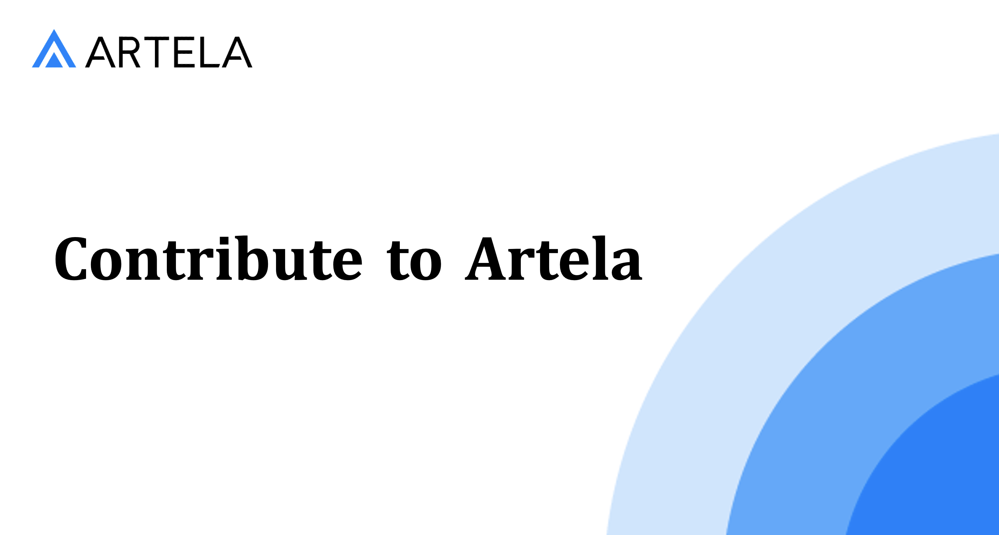

  
  <a href="https://twitter.com/Artela_Network" target="_blank">
    
  
  

This repository serves as a resource for builders interested in contributing to Artela. You can kickstart your contributions right away. If you're looking for ideas to get started, check out how you can help out here!

## **How to Contribute**

This project follows the [all-contributors](https://allcontributors.org/docs/en/overview) specification. Please read [Code of Conduct](https://github.com/artela-network/contribute-to-artela/blob/main/docs/code-of-conduct.md). On our [builder page](https://developers.artela.network/). you’ll find a number of ways to contribute. Contributions of any kind are welcome!

### [1. Submit an issue](https://github.com/artela-network/contribute-to-artela#1-submit-an-issue)

To create a new issue, you can: 

- Use [predefined issue templates](https://github.com/artela-network/contribute-to-artela/issues/new/choose)
- Open a [blank issue](https://github.com/artela-network/contribute-to-artela/issues/new/)

To get involved in an existing issue, you can:

- Comment on the issue (if you'd like to be assigned to it). This allows [our team can assign the issue to you](https://github.blog/2019-06-25-assign-issues-to-issue-commenters/).

More information on the issue creation process, and expectations around creating issues can be [found here](https://github.com/artela-network/contribute-to-artela/blob/main/docs/github-issue-triage-process.md).

### [2. Make a PR](https://github.com/artela-network/contribute-to-artela#2-make-a-pr)

1. Fork the contribute-to-artela repo. If you're not sure, here's how to [fork the repo](https://help.github.com/en/articles/fork-a-repo).
2. Include your contribution, referencing the issue it resolves (see [linking a pull request to an issue using a keyword](https://docs.github.com/en/free-pro-team@latest/github/managing-your-work-on-github/linking-a-pull-request-to-an-issue#linking-a-pull-request-to-an-issue-using-a-keyword)). Provide a link to the PR raised in another repository.
3. Extend the `contributions.json` file by following the format used for other projects already listed.
4. After your changes are committed to your GitHub fork, submit a pull request (PR) to the `dev` branch of the repo

### 3. [Wait for review](https://github.com/artela-network/contribute-to-artela#3-wait-for-review)

Acceptable PRs will be approved & merged into the `dev` branch

### 4. Collecting bounty
Coming Soon